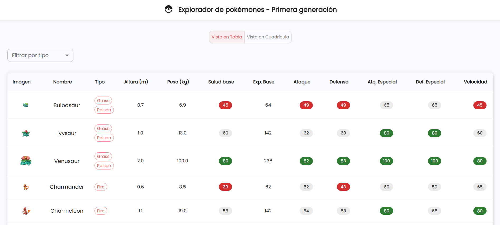
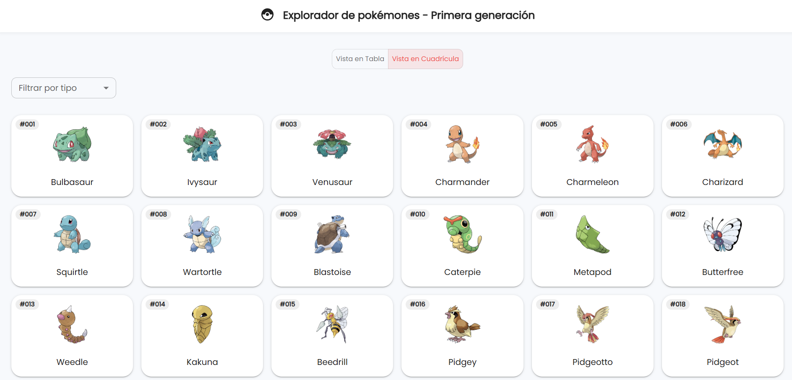
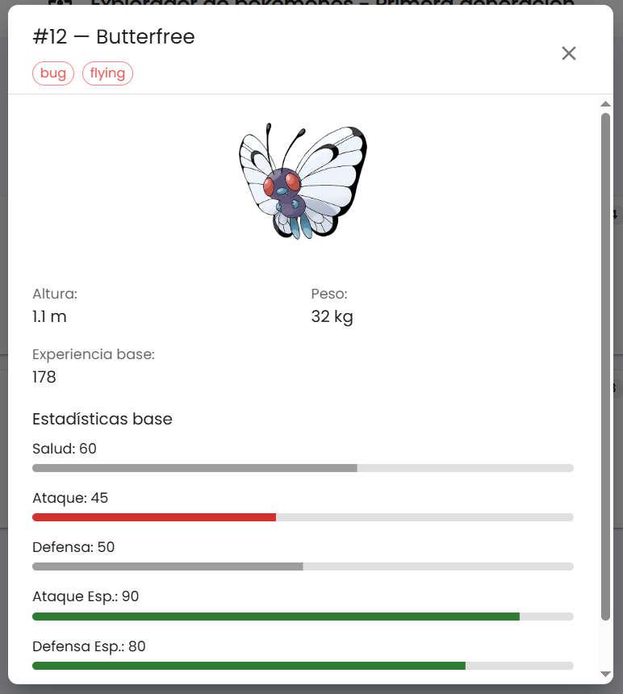
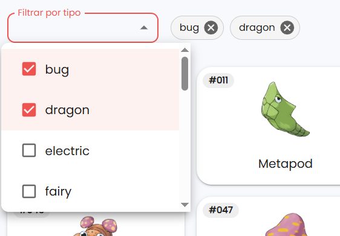
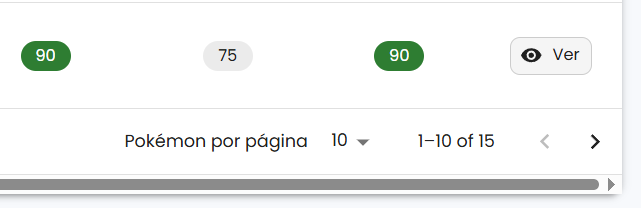

# Explorador de Pokémon – Primera Generación

Aplicación web desarrollada con **React + Next.js** y **Material UI** que permite explorar los 151 Pokémon de la primera generación. Ofrece dos vistas (tabla y cuadrícula), filtros por tipo, modal con detalles de los pokémones, entre otras funcionalidades.

---

## 🌐 Demo

🔗 Puedes ver la aplicación funcionando aquí 👉 [Ver aplicación en Vercel](https://explorer-pokemon-app.vercel.app/)

---

## 📸 Captura de pantalla

Vista tabla | Vista cuadrícula  
:--:|:--:  
 | 

Modal de detalles



Filtros activos



Paginación en la vista de tabla y opcion para ver detalles



---

## 🛠️ Tecnologías utilizadas

- [Next.js](https://nextjs.org/)
- [React](https://reactjs.org/)
- [TypeScript](https://www.typescriptlang.org/)
- [Material UI (MUI)](https://mui.com/)
- [TanStack Table](https://tanstack.com/table/latest)
- [PokéAPI](https://pokeapi.co)

---

## 🔧 Instrucciones para correr el proyecto localmente

1. **Clonar el repositorio**:

Abrir una terminal o línea de comandos y ejecutar los siguientes comandos:
```
git clone https://github.com/Daniela1421/pokemon-app.git
cd pokemon-app
```

2. **Instalar dependencias del proyecto**:

```
npm install 
```

3. **Correr el servidor en desarrollo**: 

```
npm run dev
```

4. **Abrir aplicación en el navegador**

```
http://localhost:3000
```

---

## ✨ Autor

[Daniela Ducuara Cañas](https://github.com/Daniela1421)

